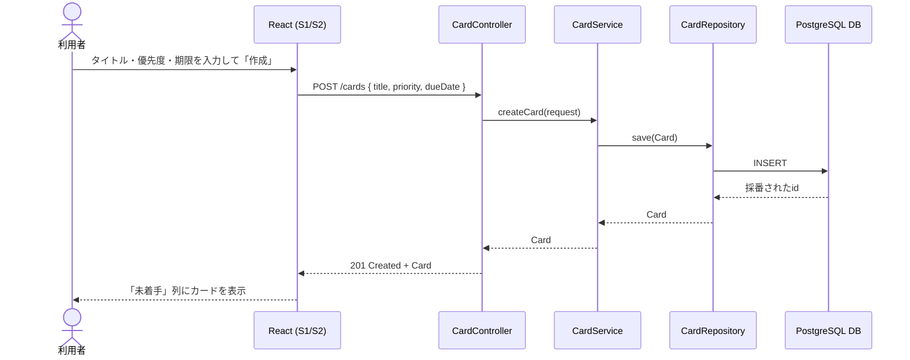
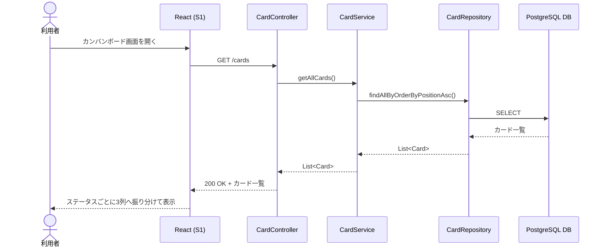
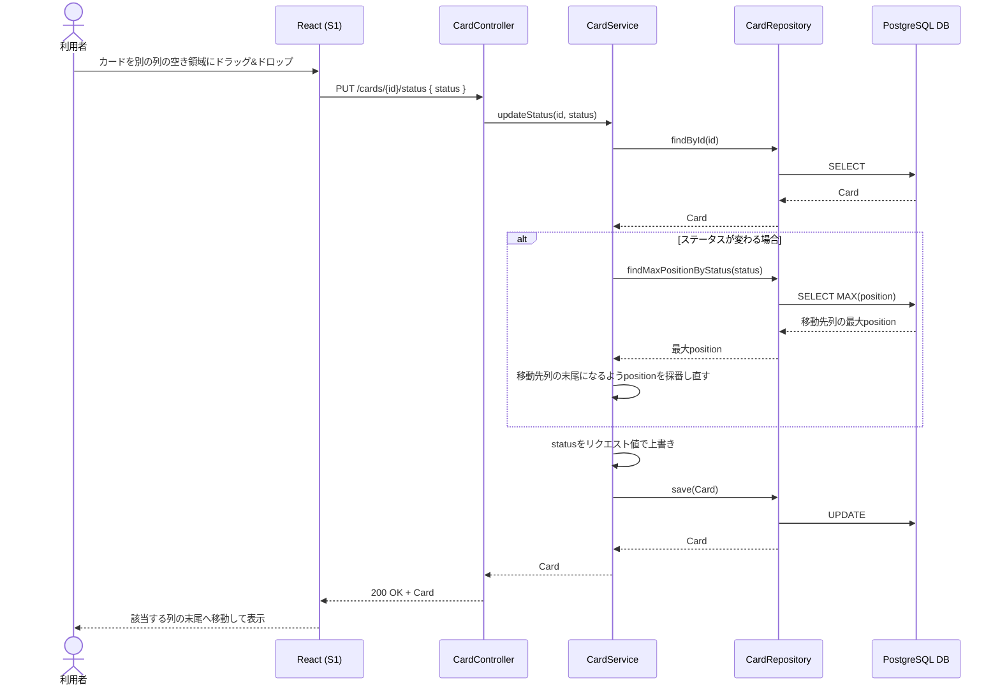
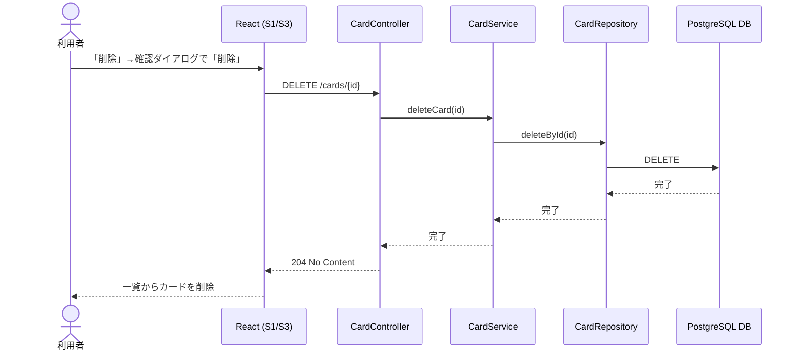
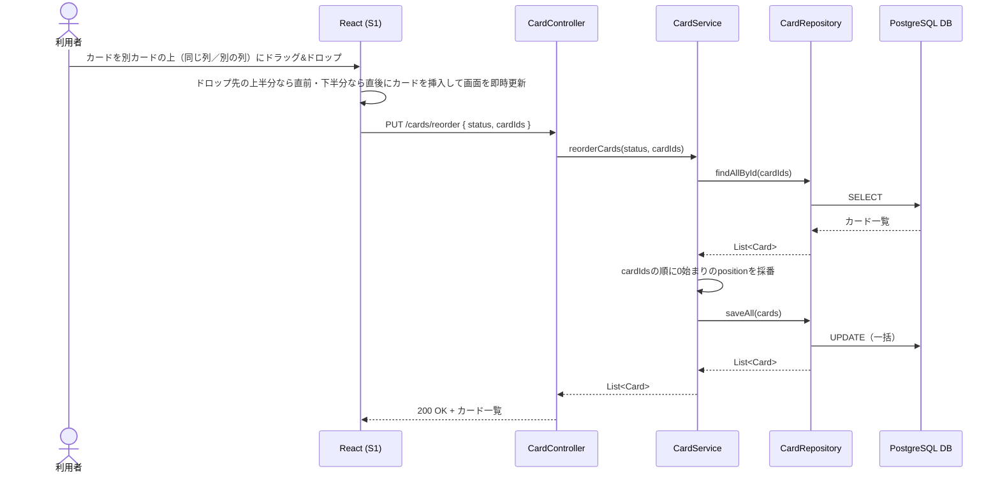
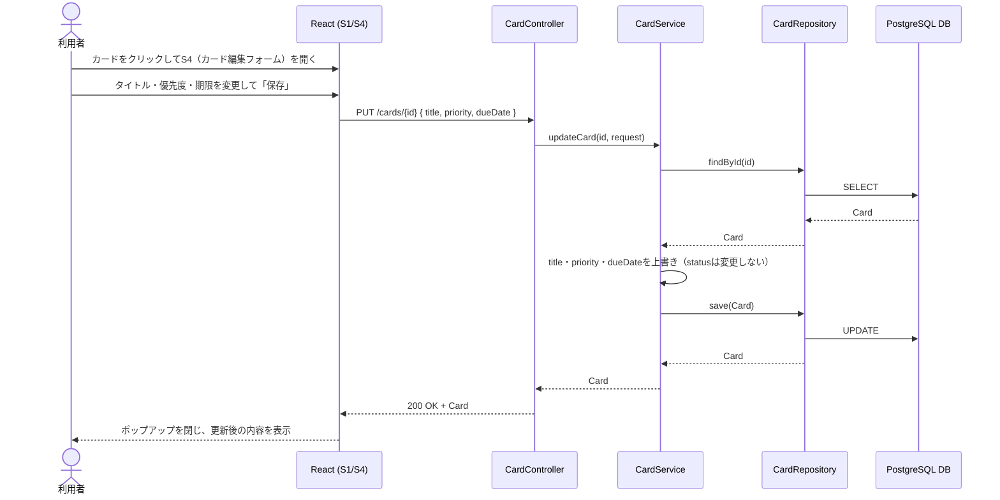

[« 要件定義書に戻る](requirements.md)

# API仕様：TaskManagement

## API一覧

| メソッド | URL | 内容 |
|---|---|---|
| GET | /cards | カード一覧取得（position昇順＝表示順で返却） |
| GET | /cards/{id} | カード詳細取得 |
| POST | /cards | カード新規作成（title・priority・dueDateを指定） |
| PUT | /cards/{id} | カード編集（title・priority・dueDateを更新。statusは変更しない） |
| PUT | /cards/{id}/status | ステータス変更（リクエストボディで指定した任意のステータスに変更） |
| PUT | /cards/reorder | 同一列内の並び替え（status・並び替え後の全cardIdsを指定してpositionを振り直す） |
| DELETE | /cards/{id} | カード削除 |

データ項目（Cardのフィールド）は[データベース設計](database.md)を参照。

「期限順」「優先度順」への切り替えはフロントエンド側で `GET /cards` の結果を並べ替えるのみで実現し、
API通信・永続化は行わない。同一列内の手動ドラッグ並び替えは `PUT /cards/reorder` でサーバーに保存する。

バリデーションエラー・不正なリクエストボディの場合は、`GlobalExceptionHandler`により
`{"message": "..."}` 形式のレスポンスボディで統一して400を返す。

## シーケンス図

各ユースケースにおける、画面（React）とバックエンド（Controller / Service / Repository / DB）間のやり取りを示す。
各ユースケースの詳細は[機能要件](features.md)を参照。

### UC1: カード作成

### UC2: カード一覧取得

### UC3: ステータス変更（ドラッグ&ドロップ）

移動先が前の列（例: 完了→進行中）であっても同じAPIで対応する。ステータスの前後関係による制約はない。
別の列の特定のカードの上にドロップした場合は、このAPIに続けてUC5（並び替え）の`PUT /cards/reorder`が呼ばれ、
挿入位置（直前/直後）が反映される。

### UC4: カード削除

### UC5: 並び替え

「期限順」「優先度順」への切り替えはAPI通信を伴わず、`GET /cards`（UC2）で取得済みのカード一覧を
フロントエンドの状態として保持したまま並べ替えるのみで完結する。画面を再読み込みすると、並び替え条件は初期値（追加順）に戻る。

別カードの上への手動ドラッグ並び替えは、以下のシーケンスでサーバーに保存する。
別の列のカードにドロップした場合は、事前にUC3の`PUT /cards/{id}/status`でステータス変更が行われた上でこのAPIが呼ばれる。

`cardIds`に含まれるカードが指定した`status`と一致しない場合、またはIDが1件でも存在しない場合は400を返す。

### UC6: カード編集

対象カードが存在しない場合は404を返す。
