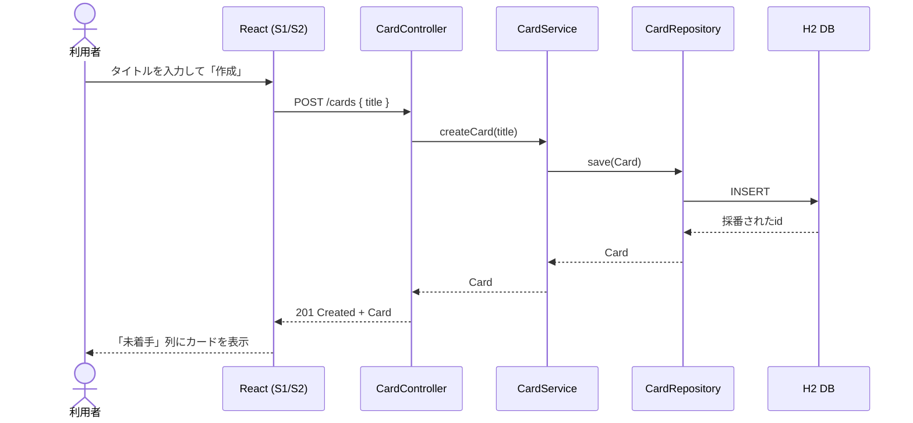
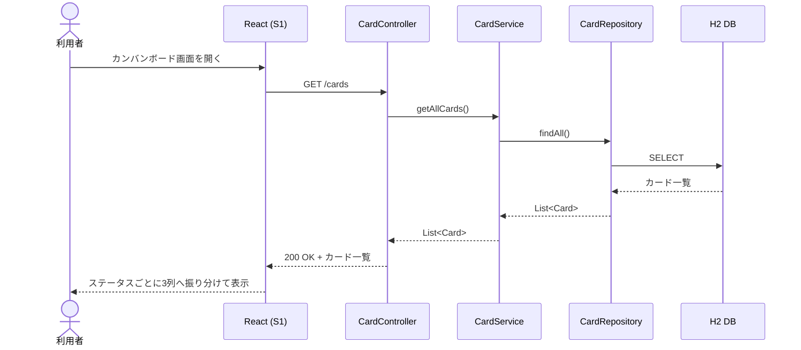
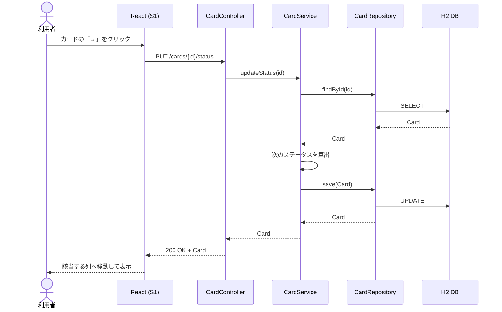
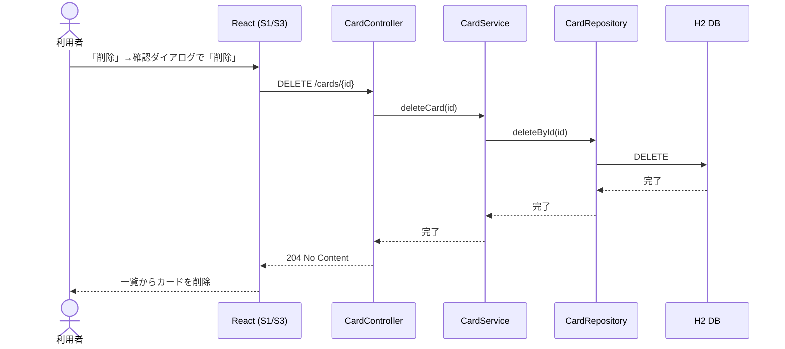

[« 要件定義書に戻る](requirements.md)

# API仕様：TaskManagement

## API一覧

| メソッド | URL | 内容 |
|---|---|---|
| GET | /cards | カード一覧取得 |
| GET | /cards/{id} | カード詳細取得 |
| POST | /cards | カード新規作成 |
| PUT | /cards/{id}/status | ステータス変更 |
| DELETE | /cards/{id} | カード削除 |

データ項目（Cardのフィールド）は[データベース設計](database.md)を参照。

## シーケンス図

各ユースケースにおける、画面（React）とバックエンド（Controller / Service / Repository / DB）間のやり取りを示す。
各ユースケースの詳細は[機能要件](features.md)を参照。

### UC1: カード作成

### UC2: カード一覧取得

### UC3: ステータス変更

### UC4: カード削除

