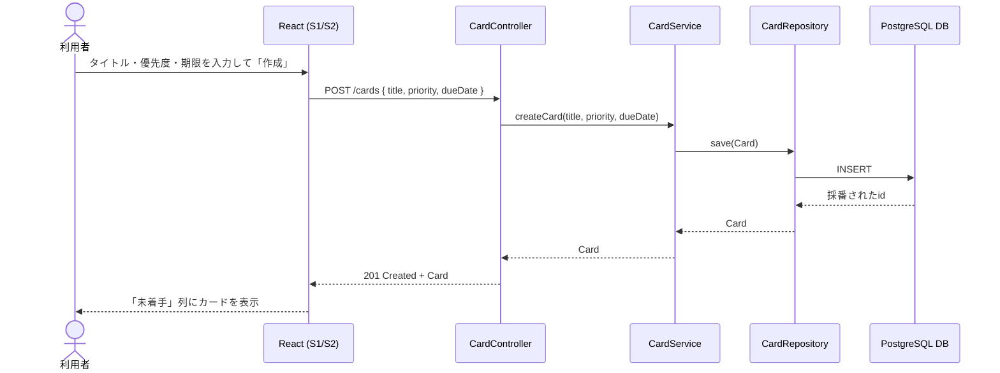
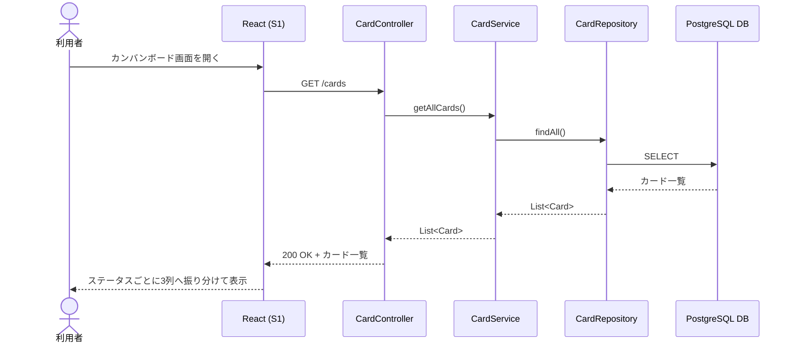
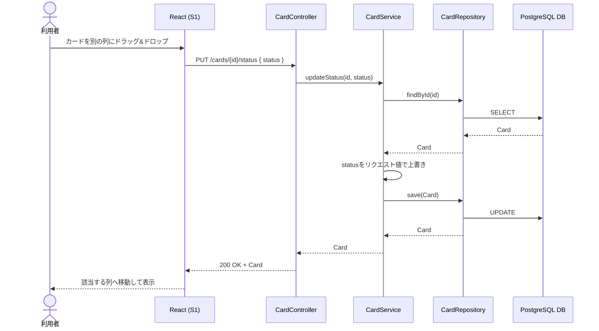
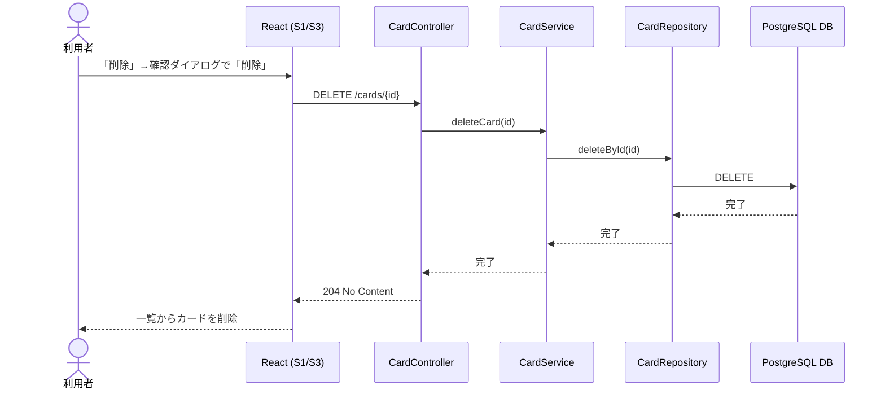

[« 要件定義書に戻る](requirements.md)

# API仕様：TaskManagement

## API一覧

| メソッド | URL | 内容 |
|---|---|---|
| GET | /cards | カード一覧取得（id昇順＝作成順で返却） |
| GET | /cards/{id} | カード詳細取得 |
| POST | /cards | カード新規作成（title・priority・dueDateを指定） |
| PUT | /cards/{id}/status | ステータス変更（リクエストボディで指定した任意のステータスに変更） |
| DELETE | /cards/{id} | カード削除 |

データ項目（Cardのフィールド）は[データベース設計](database.md)を参照。

「期限順」「優先度順」の並び替え、および同一列内の手動並び替えは、いずれもフロントエンド側で
`GET /cards` の結果を並べ替えるのみで実現する。並び替え専用のAPI・クエリパラメータは設けない。

## シーケンス図

各ユースケースにおける、画面（React）とバックエンド（Controller / Service / Repository / DB）間のやり取りを示す。
各ユースケースの詳細は[機能要件](features.md)を参照。

### UC1: カード作成

### UC2: カード一覧取得

### UC3: ステータス変更（ドラッグ&ドロップ）

移動先が前の列（例: 完了→進行中）であっても同じAPIで対応する。ステータスの前後関係による制約はない。

### UC4: カード削除

### UC5: 並び替え（クライアント側のみ）

並び替え（追加順／期限順／優先度順への切り替え、同一列内の手動ドラッグ並び替え）はAPI通信を伴わない。
`GET /cards`（UC2）で取得済みのカード一覧を、フロントエンドの状態として保持したまま並べ替えるのみで完結する。
画面を再読み込みすると、並び替え条件は初期値（追加順）に戻る。
