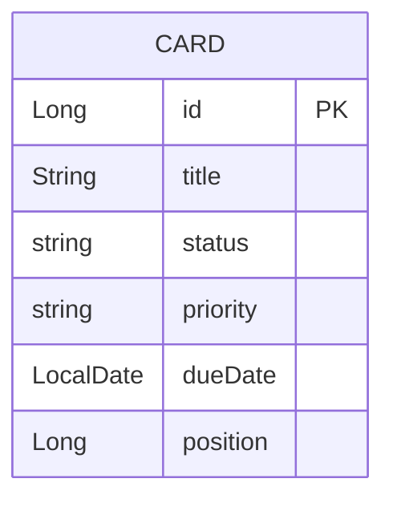

[« 要件定義書に戻る](requirements.md)

# データベース設計：TaskManagement

## データ項目

### Card（カード）

| 項目名 | 型 | 説明 |
|---|---|---|
| id | Long | カードID（自動採番） |
| title | String | カードのタイトル |
| status | Enum | ステータス（TODO / DOING / DONE） |
| priority | Enum | 優先度（HIGH / MID / LOW）。作成時必須、デフォルトMID |
| dueDate | LocalDate | 期限。任意項目のためnull許容 |
| position | Long | 表示順（「追加順」の並び順）。新規作成時は全体の末尾（既存の最大値+1）を採番する。ステータス変更時は移動先ステータス内の末尾に、ドラッグ&ドロップによる並び替え時は指定順に振り直す |

「期限順」「優先度順」への切り替えはフロントエンド側で都度算出し、永続化しない。
詳細は[API仕様](api.md)を参照。

## ER図

MVPではエンティティが `Card` のみであり、他テーブルとのリレーションは存在しない。
将来的にユーザーやボードのエンティティを追加する場合は、`Card` との関連（例: ユーザー1対多カード）を別途設計する。

DBの物理構成（PostgreSQL、永続化の方針など）は[要件定義書の非機能要件](requirements.md#非機能要件)と[技術スタック](tech-stack.md)を参照。
