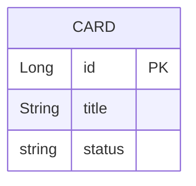

[« 要件定義書に戻る](requirements.md)

# データベース設計：TaskManagement

## データ項目

### Card（カード）

| 項目名 | 型 | 説明 |
|---|---|---|
| id | Long | カードID（自動採番） |
| title | String | カードのタイトル |
| status | Enum | ステータス（TODO / DOING / DONE） |

## ER図

MVPではエンティティが `Card` のみであり、他テーブルとのリレーションは存在しない。
将来的にユーザーやボードのエンティティを追加する場合は、`Card` との関連（例: ユーザー1対多カード）を別途設計する。

DBの物理構成（H2インメモリ、永続化しない旨など）は[要件定義書の非機能要件](requirements.md#非機能要件)を参照。
