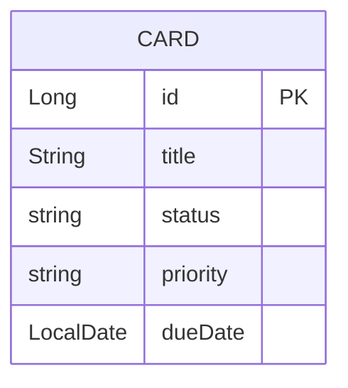

[« 要件定義書に戻る](requirements.md)

# データベース設計：TaskManagement

## データ項目

### Card（カード）

| 項目名 | 型 | 説明 |
|---|---|---|
| id | Long | カードID（自動採番）。並び替えの「追加順」はこのidの昇順とする |
| title | String | カードのタイトル |
| status | Enum | ステータス（TODO / DOING / DONE） |
| priority | Enum | 優先度（HIGH / MID / LOW）。作成時必須、デフォルトMID |
| dueDate | LocalDate | 期限。任意項目のためnull許容 |

同じ列内でのカードの並び順（手動ドラッグによる並び替え）は、専用の項目を持たず永続化しない。
表示順はフロントエンド側で「追加順（id昇順）／期限順／優先度順」のいずれかを都度算出する。
詳細は[API仕様](api.md)を参照。

## ER図

MVPではエンティティが `Card` のみであり、他テーブルとのリレーションは存在しない。
将来的にユーザーやボードのエンティティを追加する場合は、`Card` との関連（例: ユーザー1対多カード）を別途設計する。

DBの物理構成（PostgreSQL、永続化の方針など）は[要件定義書の非機能要件](requirements.md#非機能要件)と[技術スタック](tech-stack.md)を参照。
