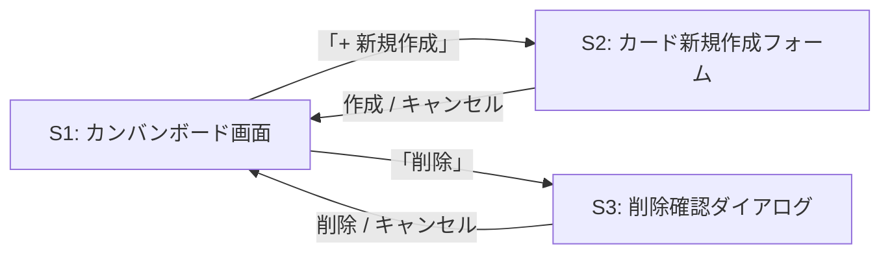
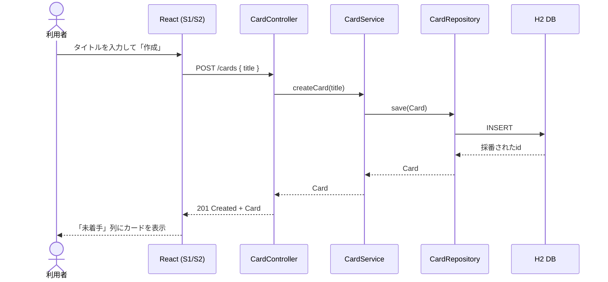
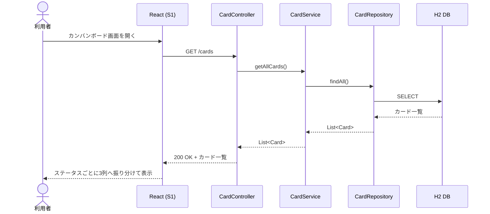
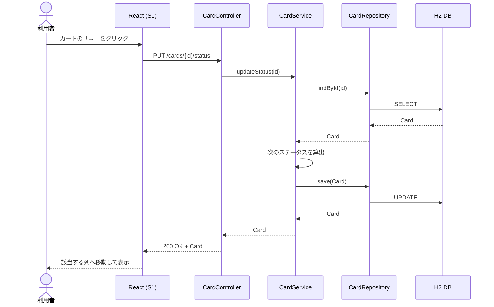
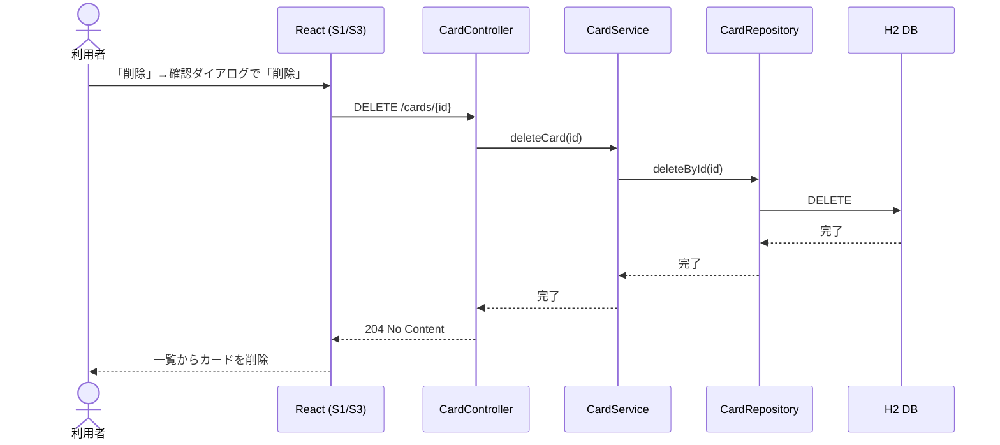
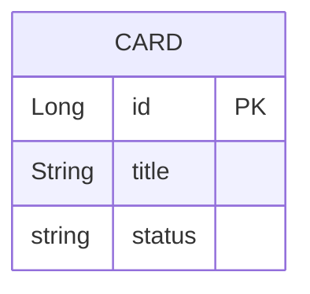

# 要件定義書：TaskManagement（Trello風タスク管理アプリ）

## 背景・目的

本アプリは、プログラミングスクールの課題として開発する学習用のタスク管理アプリである。
実務での利用や商用サービス化を目的としたものではなく、以下を達成することを目的とする。

- Spring Boot（バックエンド）＋ React（フロントエンド）を用いた、要件定義から設計・実装・動作確認までの一連の開発フローを自分の手で経験すること
- REST APIの設計・実装（Controller / Service / Repository）と、フロントエンドからのAPI連携という、Webアプリケーション開発の基本構造を理解すること
- Trelloのような実務でよく使われるカンバンボードUIを題材に、画面設計・状態管理の考え方を学ぶこと

そのため、機能は必要最小限（MVP）に絞り、認証・複数ボードなどの発展的な機能は今回のスコープ外とする。

## 機能一覧（MVP）

| 機能 | 内容 |
|---|---|
| カード作成 | タイトルを入力してカードを新規作成する |
| カード一覧取得 | 登録されている全カードを取得する |
| カード詳細取得 | IDを指定して1件のカードを取得する |
| カードのステータス変更 | カードを「未着手／進行中／完了」の間で移動する |
| カード削除 | カードを削除する |

以下は今回のスコープ外（将来的な拡張候補）とする。

- ログイン・ユーザー管理機能
- 複数ボード機能
- ドラッグ&ドロップによるステータス変更（今回はボタン操作で代替する）
- 期限・担当者などの付加情報
- レスポンシブ対応（スマートフォン・タブレット表示）

## 非機能要件

学習用アプリであることを踏まえ、本番運用水準は求めず、以下の方針とする。

| 分類 | 要件 | 補足 |
|---|---|---|
| 性能 | 一覧表示は体感1秒以内 | カード件数は100件程度までを想定した上での目安。負荷試験は行わない |
| 可用性 | SLAは定めない | ローカル環境での動作を前提とし、常時稼働は求めない |
| セキュリティ | 認証・認可は実装しない | 外部公開はせず、ローカル環境限定での利用を前提とする。HTTPS化・CSRF対策等の本番向け対策は行わない |
| データ永続化 | H2インメモリDBを使用 | アプリケーション再起動でデータは初期化される。バックアップ・リストア機能は持たない |
| 保守性 | レイヤードアーキテクチャを採用 | Controller / Service / Repository層に分離し、可読性・拡張性を意識する |
| 動作環境（バックエンド） | Java 17以上、Spring Boot 3系 | |
| 動作環境（フロントエンド） | Google Chrome最新版で動作確認 | 他ブラウザでの動作保証はしない |
| ログ | コンソール出力のみ | 外部ログ基盤との連携は行わない |
| 画面表示 | PCデスクトップ画面（横幅1280px程度）を前提 | レスポンシブ対応は行わない |

## 画面仕様

フロントエンドはReactで実装し、Spring Boot側のREST APIをfetch（またはaxios）で呼び出す構成とする。
フロントエンドとバックエンドは別オリジンで動作するため、バックエンド側でCORS設定を行う。

### 画面一覧

| 画面ID | 画面名 | 概要 |
|---|---|---|
| S1 | カンバンボード画面 | メイン画面。全カードを「未着手／進行中／完了」の3列で表示する |
| S2 | カード新規作成フォーム | S1上のモーダルとして表示し、タイトルを入力してカードを作成する |
| S3 | 削除確認ダイアログ | カード削除前に誤操作防止のため確認を挟む |

詳細画面（カードをクリックして詳細を見る専用の画面）は設けない。MVPで保持する情報（タイトル・ステータス）は
カンバンボード上のカード表示だけで確認できるため、S1に統合する。

### 画面遷移図

S2・S3はS1上に重ねて表示するモーダルであり、独立したページ遷移は発生しない。



### S1: カンバンボード画面（ワイヤーフレーム）

```
┌──────────────────────────────────────────────┐
│ TaskManagement                  [+ 新規作成]   │
├───────────────┬───────────────┬───────────────┤
│   未着手       │   進行中       │    完了        │
├───────────────┼───────────────┼───────────────┤
│ [カードA   →] │ [カードC   →] │ [カードE    ] │
│ [削除]        │ [削除]        │ [削除]        │
│               │               │               │
│ [カードB   →] │ [カードD   →] │               │
│ [削除]        │ [削除]        │               │
└───────────────┴───────────────┴───────────────┘
```

- 各カードには「→」ボタン（次のステータスへ進める）と「削除」ボタンを表示する
- 「完了」列のカードには「→」ボタンを表示しない（次の遷移先がないため）
- 「未着手」列のカードに「←」は設けない。前の状態へ戻す操作はMVPスコープ外とする
- 画面右上の「+ 新規作成」ボタンでS2（カード新規作成フォーム）を開く

### S2: カード新規作成フォーム（モーダル）

```
┌───────────────────────────┐
│ 新規カード作成           × │
├───────────────────────────┤
│ タイトル                   │
│ [_____________________]   │
│                             │
│           [キャンセル][作成]│
└───────────────────────────┘
```

- タイトル未入力のまま「作成」を押した場合はエラーメッセージを表示し、送信しない
- 作成成功後はモーダルを閉じ、S1の「未着手」列に新しいカードを表示する

### S3: 削除確認ダイアログ

```
┌───────────────────────────┐
│ 確認                       │
├───────────────────────────┤
│ 「カードA」を削除しますか？ │
│                             │
│           [キャンセル][削除]│
└───────────────────────────┘
```

## ユースケース・操作フロー

### UC1: カードを新規作成する

- アクター: 利用者（自分）
- 事前条件: カンバンボード画面（S1）を開いている
- 基本フロー:
  1. 「+ 新規作成」ボタンをクリックし、S2を開く
  2. タイトルを入力し「作成」ボタンを押す
  3. `POST /cards` が呼ばれ、カードが作成される
  4. S1の「未着手」列に新しいカードが表示される
- 代替フロー:
  - タイトルが未入力の場合、送信せずエラーメッセージを表示する

### UC2: カード一覧を確認する

- 事前条件: なし
- 基本フロー:
  1. カンバンボード画面（S1）を開く
  2. `GET /cards` が呼ばれ、全カードを取得する
  3. 取得したカードをステータスごとに3列へ振り分けて表示する

### UC3: カードのステータスを変更する

- 事前条件: ステータスが「未着手」または「進行中」のカードが存在する
- 基本フロー:
  1. 対象カードの「→」ボタンをクリックする
  2. `PUT /cards/{id}/status` が呼ばれ、次のステータスに更新される（未着手→進行中→完了）
  3. カードが該当する列へ移動する

### UC4: カードを削除する

- 事前条件: 削除対象のカードが存在する
- 基本フロー:
  1. 対象カードの「削除」ボタンをクリックし、S3（削除確認ダイアログ）を開く
  2. 「削除」を押すと `DELETE /cards/{id}` が呼ばれる
  3. カードが一覧から消える
- 代替フロー:
  - 「キャンセル」を押した場合、削除せずダイアログを閉じる

### 全体の操作フロー（概略）

```
カンバンボード表示（UC2）
   │
   ├─ [+ 新規作成] → 新規作成フォーム（UC1） → 未着手列に追加
   │
   ├─ カード「→」 → ステータス変更（UC3） → 次の列へ移動
   │
   └─ カード「削除」 → 削除確認（UC4） → 一覧から削除
```

## シーケンス図

各ユースケースにおける、画面（React）とバックエンド（Controller / Service / Repository / DB）間のやり取りを示す。

### UC1: カード作成



### UC2: カード一覧取得



### UC3: ステータス変更



### UC4: カード削除



## データ項目

### Card（カード）

| 項目名 | 型 | 説明 |
|---|---|---|
| id | Long | カードID（自動採番） |
| title | String | カードのタイトル |
| status | Enum | ステータス（TODO / DOING / DONE） |

### ER図

MVPではエンティティが `Card` のみであり、他テーブルとのリレーションは存在しない。
将来的にユーザーやボードのエンティティを追加する場合は、`Card` との関連（例: ユーザー1対多カード）を別途設計する。



## API一覧

| メソッド | URL | 内容 |
|---|---|---|
| GET | /cards | カード一覧取得 |
| GET | /cards/{id} | カード詳細取得 |
| POST | /cards | カード新規作成 |
| PUT | /cards/{id}/status | ステータス変更 |
| DELETE | /cards/{id} | カード削除 |

## 使用技術

- バックエンド：Java / Spring Boot / Spring Data JPA
- DB：H2（インメモリ）
- フロントエンド：React（fetch/axiosでREST APIを呼び出し）
- フロントエンド・バックエンド間：別オリジン構成のためCORS設定が必要
- 確認方法：React画面から動作確認。API単体の確認にはPostman等も併用可能
