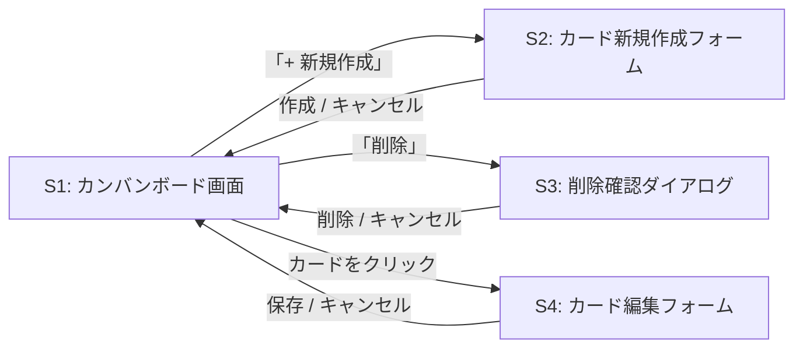

[« 要件定義書に戻る](requirements.md)

# 画面仕様：TaskManagement

フロントエンドはReactで実装し、Spring Boot側のREST APIをfetch（またはaxios）で呼び出す構成とする。
フロントエンドとバックエンドは別オリジンで動作するため、バックエンド側でCORS設定を行う。

## 画面一覧

| 画面ID | 画面名 | 概要 |
|---|---|---|
| S1 | カンバンボード画面 | メイン画面。全カードを「未着手／進行中／完了」の3列で表示する |
| S2 | カード新規作成フォーム | S1上のモーダルとして表示し、タイトルを入力してカードを作成する |
| S3 | 削除確認ダイアログ | カード削除前に誤操作防止のため確認を挟む |
| S4 | カード編集フォーム | S1上のモーダルとして表示し、既存カードのタイトル・優先度・期限を変更する |

カードをクリックすると詳細確認を兼ねてS4（カード編集フォーム）が開く。専用の閲覧のみの詳細画面は設けず、
確認と編集をS4に統合する。

## 画面遷移図

S2・S3・S4はS1上に重ねて表示するモーダルであり、独立したページ遷移は発生しない。



## S1: カンバンボード画面（ワイヤーフレーム）

```
┌────────────────────────────────────────────────────────┐
│ タスク管理                  並び替え:[追加順▾] [+ 新規作成]│
├───────────────────┬───────────────────┬───────────────────┤
│   未着手           │   進行中           │    完了            │
├───────────────────┼───────────────────┼───────────────────┤
│ ┌─────────────┐   │ ┌─────────────┐   │ ┌─────────────┐   │
│ │ カードA      │   │ │ カードC      │   │ │ カードE      │   │
│ │ 優先度:高 期限8/20│   │ │ 優先度:中 期限超過8/16│   │ │ 優先度:中 期限8/14│   │
│ │        [削除]│   │ │        [削除]│   │ │        [削除]│   │
│ └─────────────┘   │ └─────────────┘   │ └─────────────┘   │
│ ┌─────────────┐   │ ┌─────────────┐   │               │
│ │ カードB      │   │ │ カードD      │   │               │
│ │ 優先度:低    │   │ │ 優先度:高 期限8/22│   │               │
│ │        [削除]│   │ │        [削除]│   │               │
│ └─────────────┘   │ └─────────────┘   │               │
└───────────────────┴───────────────────┴───────────────────┘
```

- 各カードにはタイトルに加え、優先度（高／中／低）と期限（設定時のみ）を表示する。期限を過ぎた未完了カードは「期限超過」の表示にする
- カードはドラッグ&ドロップで操作する。「→」のような単方向の移動ボタンは設けない
  - 列の空いている領域にドロップ：カードのステータスをドロップ先の列に変更し、その列の末尾に追加する（前後どちらの方向にも移動可能）
  - 別カードの上にドロップ：ドロップ先カードの上半分なら直前に、下半分なら直後に挿入する。ドロップ先が別の列のカードであれば、挿入と同時にステータスもそのカードの列に変更する
- カードをクリックするとS4（カード編集フォーム）が開く
- 画面上部の並び替えセレクトで「追加順／期限順／優先度順」を切り替えられる。切り替えると全列のカードがその条件で並び直る
- 手動でドラッグ並び替えをすると、並び替えセレクトは自動的に「追加順」に戻る
- 画面右上の「+ 新規作成」ボタンでS2（カード新規作成フォーム）を開く
- スマートフォン幅（〜700px程度）では、未着手／進行中／完了の3列を横並びではなく縦に積んで表示する。トップバーもタイトルと操作（並び替えセレクト・新規作成ボタン）を上下に分けて表示する

## S2: カード新規作成フォーム（モーダル）

```
┌───────────────────────────┐
│ 新規カード作成           × │
├───────────────────────────┤
│ タイトル                   │
│ [_____________________]   │
│                             │
│ 優先度            期限（任意）│
│ [中          ▾]  [____/__/__]│
│                             │
│           [キャンセル][作成]│
└───────────────────────────┘
```

- タイトル未入力のまま「作成」を押した場合はエラーメッセージを表示し、送信しない
- 優先度は「高／中／低」の選択式で、デフォルトは「中」
- 期限は任意項目とし、未入力のまま作成できる
- 作成成功後はモーダルを閉じ、S1の「未着手」列に新しいカードを表示する

## S3: 削除確認ダイアログ

```
┌───────────────────────────┐
│ 確認                       │
├───────────────────────────┤
│ 「カードA」を削除しますか？ │
│                             │
│           [キャンセル][削除]│
└───────────────────────────┘
```

## S4: カード編集フォーム（モーダル）

```
┌───────────────────────────┐
│ カードを編集             × │
├───────────────────────────┤
│ タイトル                   │
│ [_____________________]   │
│                             │
│ 優先度            期限（任意）│
│ [高          ▾]  [2026/08/20]│
│                             │
│           [キャンセル][保存]│
└───────────────────────────┘
```

- 対象カードの現在のタイトル・優先度・期限を初期値として表示する
- タイトル未入力のまま「保存」を押した場合はエラーメッセージを表示し、送信しない
- ステータスはこの画面では変更しない（ステータス変更はS1でのドラッグ&ドロップのみ）
- 保存成功後はモーダルを閉じ、S1に変更後の内容を反映する

各画面での操作に対応するユースケースは[機能要件](features.md)、呼び出すAPIは[API仕様](api.md)を参照。
