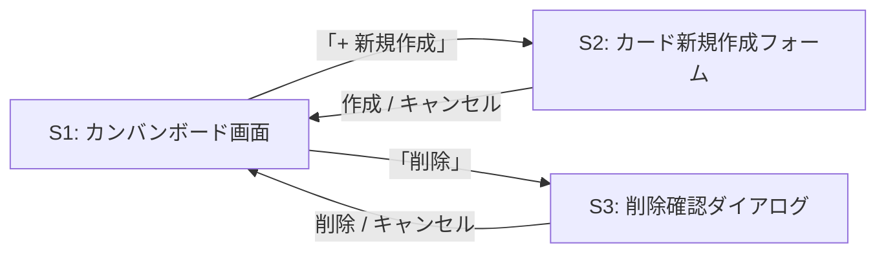

[« 要件定義書に戻る](requirements.md)

# 画面仕様：TaskManagement

フロントエンドはReactで実装し、Spring Boot側のREST APIをfetch（またはaxios）で呼び出す構成とする。
フロントエンドとバックエンドは別オリジンで動作するため、バックエンド側でCORS設定を行う。

## 画面一覧

| 画面ID | 画面名 | 概要 |
|---|---|---|
| S1 | カンバンボード画面 | メイン画面。全カードを「未着手／進行中／完了」の3列で表示する |
| S2 | カード新規作成フォーム | S1上のモーダルとして表示し、タイトルを入力してカードを作成する |
| S3 | 削除確認ダイアログ | カード削除前に誤操作防止のため確認を挟む |

詳細画面（カードをクリックして詳細を見る専用の画面）は設けない。MVPで保持する情報（タイトル・ステータス）は
カンバンボード上のカード表示だけで確認できるため、S1に統合する。

## 画面遷移図

S2・S3はS1上に重ねて表示するモーダルであり、独立したページ遷移は発生しない。



## S1: カンバンボード画面（ワイヤーフレーム）

```
┌──────────────────────────────────────────────┐
│ TaskManagement                  [+ 新規作成]   │
├───────────────┬───────────────┬───────────────┤
│   未着手       │   進行中       │    完了        │
├───────────────┼───────────────┼───────────────┤
│ [カードA   →] │ [カードC   →] │ [カードE    ] │
│ [削除]        │ [削除]        │ [削除]        │
│               │               │               │
│ [カードB   →] │ [カードD   →] │               │
│ [削除]        │ [削除]        │               │
└───────────────┴───────────────┴───────────────┘
```

- 各カードには「→」ボタン（次のステータスへ進める）と「削除」ボタンを表示する
- 「完了」列のカードには「→」ボタンを表示しない（次の遷移先がないため）
- 「未着手」列のカードに「←」は設けない。前の状態へ戻す操作はMVPスコープ外とする
- 画面右上の「+ 新規作成」ボタンでS2（カード新規作成フォーム）を開く

## S2: カード新規作成フォーム（モーダル）

```
┌───────────────────────────┐
│ 新規カード作成           × │
├───────────────────────────┤
│ タイトル                   │
│ [_____________________]   │
│                             │
│           [キャンセル][作成]│
└───────────────────────────┘
```

- タイトル未入力のまま「作成」を押した場合はエラーメッセージを表示し、送信しない
- 作成成功後はモーダルを閉じ、S1の「未着手」列に新しいカードを表示する

## S3: 削除確認ダイアログ

```
┌───────────────────────────┐
│ 確認                       │
├───────────────────────────┤
│ 「カードA」を削除しますか？ │
│                             │
│           [キャンセル][削除]│
└───────────────────────────┘
```

各画面での操作に対応するユースケースは[機能要件](features.md)、呼び出すAPIは[API仕様](api.md)を参照。
